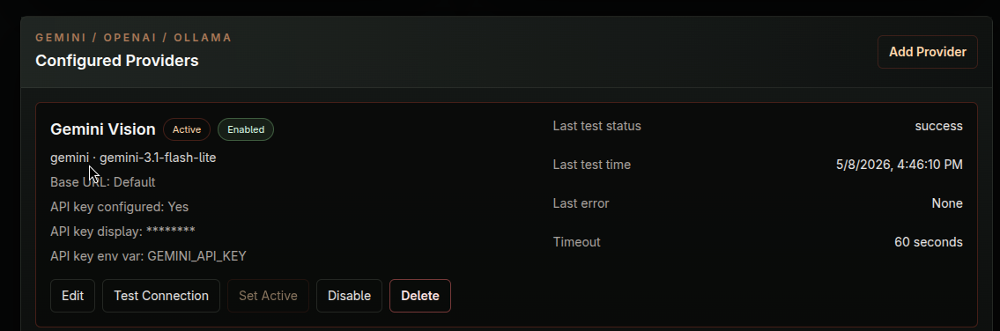

# AI Setup

FastSell v0.1 can run normal inventory, container, upload, and review workflows without AI configured. Whole Scene and AI Assist features require AI provider credentials where those features are used.

For v0.1, Gemini is the only tested AI provider. Other provider types or provider-looking settings may appear in the admin UI or code, but they are not tested or supported for v0.1.

An AI provider must be set up and configured in the Admin / AI Configuration page.

## Gemini Requirements

- No Gemini API key is included with FastSell. You must create and manage your own Gemini API key.
- The FastSell server must have internet access to reach Gemini.
- The key must have available quota and permission to use the Gemini model you configure.
- Whole Scene requires an active Gemini provider with vision enabled.
- AI Assist also depends on configured AI provider credentials where it is used.

## Configure FastSell AI Provider in Admin

In the FastSell web UI:
- Open Admin / AI Configuration.
- Create or edit a provider, such as Gemini Vision.
- Set provider type to `gemini`.
- Use a Gemini model available to your key, such as `gemini-3.1-flash-lite`.
- Leave vision enabled for Whole Scene.
- Set API Key Env Var to `GEMINI_API_KEY`.
- Timeout = 60s
- Max Tokens = 2048
- Temperature = 0.2
- Enable the provider and set it active.
- Use the provider test action to confirm it is working.

AI Assist and Whole Scene currently require the active provider to be Gemini.

## Troubleshooting

Missing key:

- Confirm Admin / AI contains the correct `GEMINI_API_KEY=...`.
- Confirm Admin / AI Configuration has API Key Env Var set to `GEMINI_API_KEY`.

No internet from server:

- Confirm the FastSell host can reach Google's Gemini API endpoints.
- Check firewall, DNS, proxy, and outbound network rules.

Provider quota or rate limits:

- Check the Gemini account quota and billing status.
- Wait for rate limits to reset or reduce AI usage.

AI feature fails while normal inventory features still work:

- Check the provider test result and API logs.
