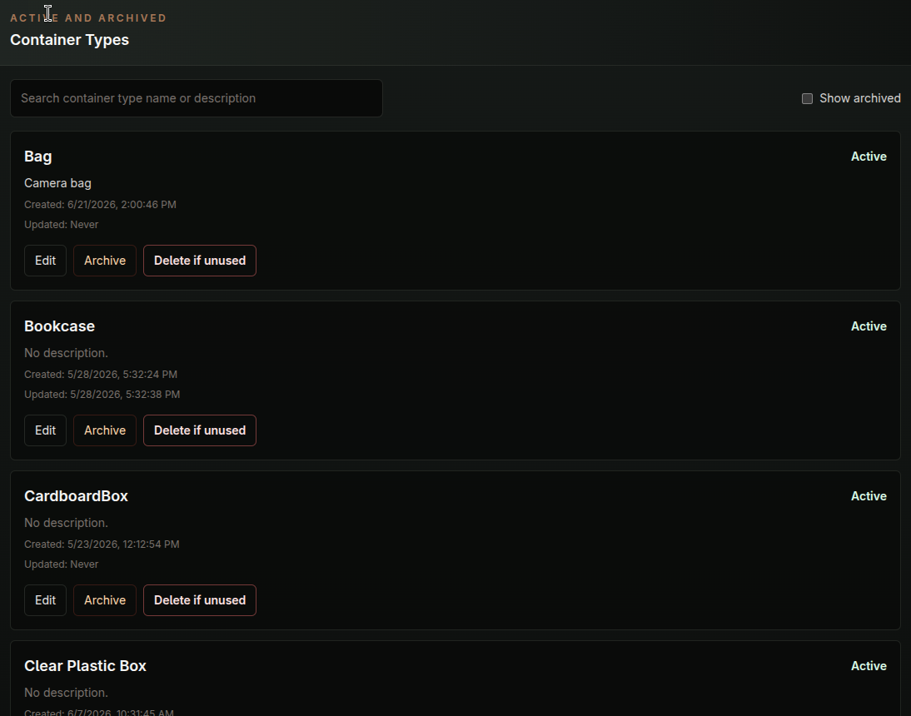
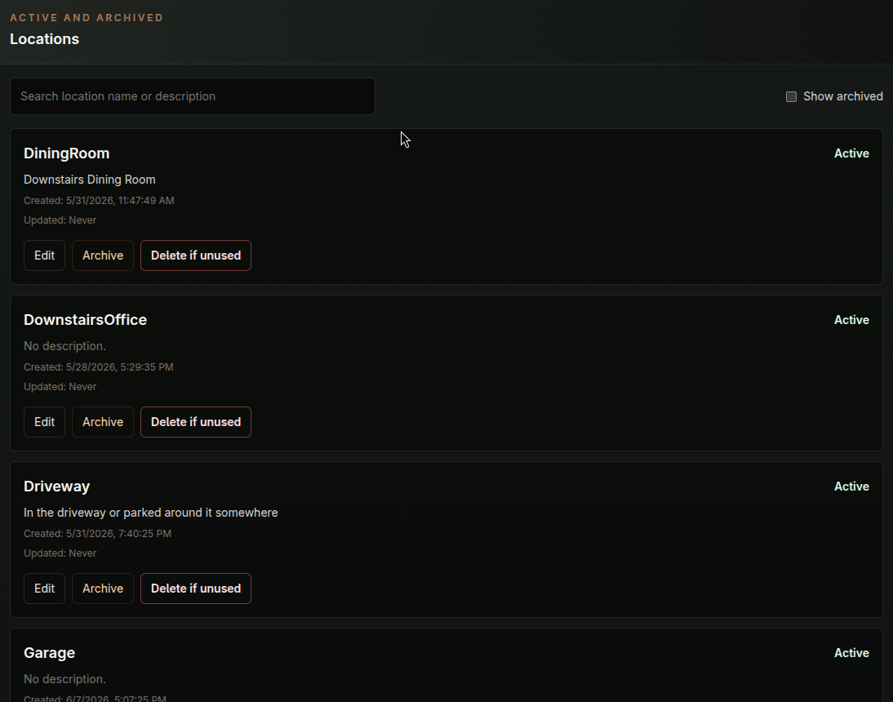
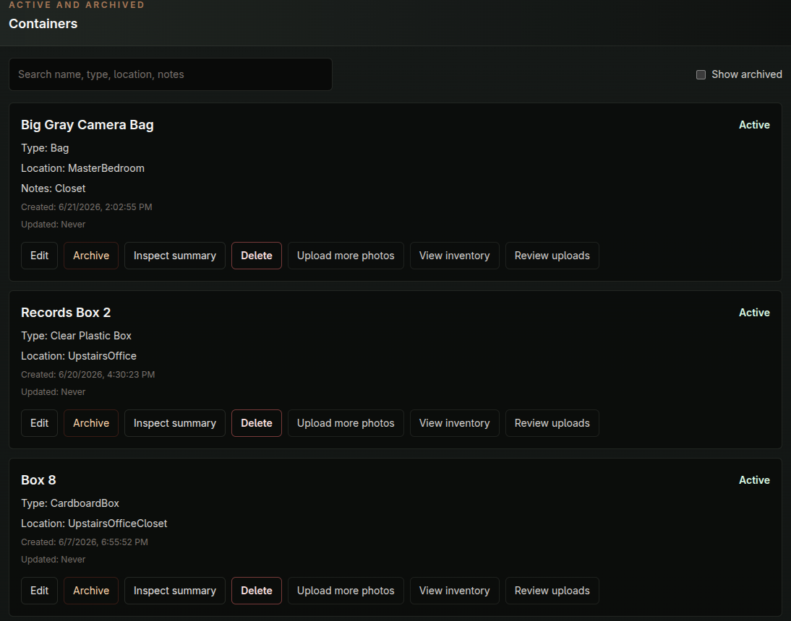

# The Basics of Workflow and How To Use FastSell

## Pre-Amble

FastSell is in pre-release and very beta.  It is a little further than MVP stage.  There are issues and incompletions.  Therefore, unless you are an advanced user or system admin, or have access to one or the other, walk away now.  One day this will not be the case, but that is where we are now.  So, with that out of the way, here we go.

## Overview of the GUI
The web app contains five pages currently (Upload, Review, Whole Scene, Inventory, Admin).
Upload - This is the starting point and where most work will be done.

Review - This is the human in the middle check. Upload items from Upload intake and Whole Scene pages will land here first before going to Inventory.

Whole Scene - This is a one shot page where the goal is to be able to take several pictures of the scene you want to identify and the AI provider will return a Title, Desc, and Appx Value.  Then it will crop images out of all of the pictures taken and attempt to assign those crops to the labels (Title/Desc) it discovered. This is very experimental and is giving some mixed results.  85% accuracy is the ultimate goal.Not there yet.

Inventory - Everything is here.  This is the final resting place for all inventory items in the system.  Many actions can be taken on them.

Admin - Contains many pages for administering the lookup items and viewing important system information.

Status Indicator - System Live is good, anything else is bad.

## Make sure the FastSell platform is fully installed.

If you haven't already follow the links below:

- [Installation](docs/Installation.md)
- [Installation Details (Technical)](docs/InstallationDetails.md)
A good test is to go to http://<localhost>:8888/

You will need to use you lan IP address for localhost if not on the same machine FastSell is installed on, but if you have a more sophisticated network setup available to you then use that.

## Setup Your Phone and a More Sophisticated Network Setup

In order to connect your phone to the FastSell platform, you will need to make sure your phone is connected to your local lan, or use a secure private network provider such as Netbird or Tailscale.  You will need to make sure you phone can get here: http://<localhost>:8888/

Although it is possible to use FastSell without your phone connected you lose the speed and portability FastSell provides.  However, if you just want to try FastSell, then skip this step.

## Configure FastSell

This will be a quick start configuration guide to orient you to what needs to be configured and in what order.  As more things are discovered it might make sense to re-order some of the items in the Admin page.  There are things that need to be done sequentially. For instance, to create a Container you have to have at least one Container_Type already created.  These are the items that each user will devise on their own to meet their own cirumstances.  I will provide some examples but feel free to use it how you will.

### Admin | Inventory Group

Go to Admin | Inventory page and create a new Inventory Group.  Household Items is setup by default.  Delete this if you don't want it. 

Here a some examples of Inventory Groups:

### Admin | Container Types

Create a Container Type.  These will be assigned to a Container.  See some examples below:

### Admin | Locations

Locations are generally only used for Containers, at least for now.  They will be assigned to a Container.  See below:

### Admin | Containers

Containers are the main storage unit in FastSell.  They can be a variety things or concepts.  They are composed of a Container Type and Location.

Here are some examples:

### The rest of the Admin Page

Admin | Sell - Contains pre-loaded sell providers. FB Marketplace is the only one currently setup.

Admin | Metrics - Some useful metrics from your data.  This will be built out more later.

Admin | Uploads - Intended to be used for the main Upload/Intake page, but not currently in use.  May not use.

Admin | System - Gives a detailed run down on System status and health.

Amdin | AI Configuration - Configure you AI provider here.  Here is the full setup page:

## Getting Items into the System

The current ways to get items into the system are by either taking pictures with your phone or uploading an existing image.  There are two ways to accomplish this.

### Upload Page
Use the upload page for methodical inventory item uploads that need to be exactly right.  Select a Container and Inventory Group.  Add a note for the upload session if desired.  The inventory group you select will apply to all items entered in the current session.  So if you select computer equipment then that will apply to everything in the session.  If you have multiple inventory groups that need to be applied either upload in multiple session or change later in the Review or Inventory pages.

-Item Group represents a single inventory item.  It might have 5 images associated with it.  An example would be a network router where you have input picutres of the front, back, top, and bottom.  If you need to add many items just click the "Add item group" button for the number of items you intend to add.

-Adding Item Groups can be quick or more detailed. You can just upload the images you want and enter no other information.  This is the preferred way of doing it.  Once all of the Item Groups have been entered, click the Upload Session button to upload them to the FastSell server and send them to the Review page.  Alternatively, you can fill out as much information about the item as you like in the Upload page.  However, if you are using AI Assist in review that is a waste of time since it will identify everyting for you.  If you need to be exact though, there maybe a use for entering your own information.  Once the session is uploaded you should get a message saying it is finished.  If you are uploading many items it will take longer.  There are file size limits in place as well.

TODO:  Document file size limits and how to view and modify.

### Whole Scene Page

This is a very experimental page where you can take several images of once scene and have AI identify everyhing in the scene with a Title, Description, and Appx value.  It is very good at this.  Accuracy is very high.  What it has not been good at is cropping the individual images out of the main images and then assigned each to it's own Title/Desc.  I have created some technology to do this but it is still in the experimental stages but is looking very promising.So the idea with Whole Scene is that if you need to intake a lot of inventory items quickly and don't need perfect accuracy, but just to fill the bins use Whole Scene.  If high accuracy is desired later then correct issues in Review.  However, I am hoping to have this at 85% accuracy very soon.

The mechanics of the page work like this:
Take or upload your photos, click Create Scene.  This will upload the photos to the server.  At this point you can Run Analysis where Whole Scene will work to pull everything out of the images and into the Whole Scene Review page.

## Inventory Management

There are two pages to dedicated to managing inventory, of course you could say the whole system is dedicated to this purpose.

### Review Page

This is human in the middle landing page where all upload/intake items go before they hit the inventory items table in the database for storage and disposition management.  

This page is composed of two sections, "Normal and Whole Scene" review.  Items that were entered via the normal intake route through the Upload page will land in the Normal review.  Items coming from the Whole Scene process will be found in the Whole Scene Review section.

Each item can be approved or rejected.  An approved item goes to Inventory a rejected item is deleted from the system.

Use AI Assist to send your images to your AI Provider of choice and have it identify the items with a Title/Desc/Appx Value, or you can do this manually with no AI intervention.  

Check the "Give AI a hint" checkbox if the item is of an unusual or special nature that AI will miss or hallucinate a Description, or if you just want a higher level of accuracy.  It's use is optional.

Adjust any values that need to be adjusted and then either Reject or Accept the item.  If you have many items on the page and you are happy with their information the click the "Accept All" button at the top of the page to add all items to inventory at once.

### Inventory Page

The Inventory Page is how all inventory items are viewed, managed, and disposed of...

The top of the page contains the search area where you can select differing critera for sorting and filtering inventory items.  All searching is fuzzy logic "instant".  If you have tens of thousands of inventory items performance may need to be adjusted.

Inventory Items are listed by default by Container.  Clicking on a container will expose the inventory items in each.  There an inventory item can be clicked and drilled into.

Functions in the Inventory Items drilldown view are Edit | Add Image | Archive | Delete

Edit allows for the changes of dispositions of the item itself (i.e., For Sale, Sold, In Use, Donated, et al.).  There is no admin page to change these values since they are part of workflow.  However, that could change in the future.

Archive sets the item to an archived status and essentially removes it from inventory.  This manifests by being removed from metrics that count active inventory etc.

Delete will hard delete the inventory item from the system.  It will cannot be restored, except through re-adding through the intake process.

## Selling Items

The last function on the Inventory Item Detail page is the Sell / Listing Drafts.  This will allow you to create a sales draft for the inventory item that can later be copied to FB Marketplace, and down the road other vendors as well.  

Most of this screen is self-explanatory.  The draft gets created and the items can be copied into FB Marketplace.  You will need to already have a FB session open in your browser and new sell item started.  Paste all the info into the FB window.  For uploading images to the FB ad you will need to be mapped to the FastSellExport directory on your FastSell server.  Here you will find the images to upload extracted and prepared for you by FastSell.

The key is make sure that you have a drive mapped to local share called: 

/srv/fastsell/fastsellexport 

to the actual server drive at:

/srv/fastsell/data/exports/listing-photos/

